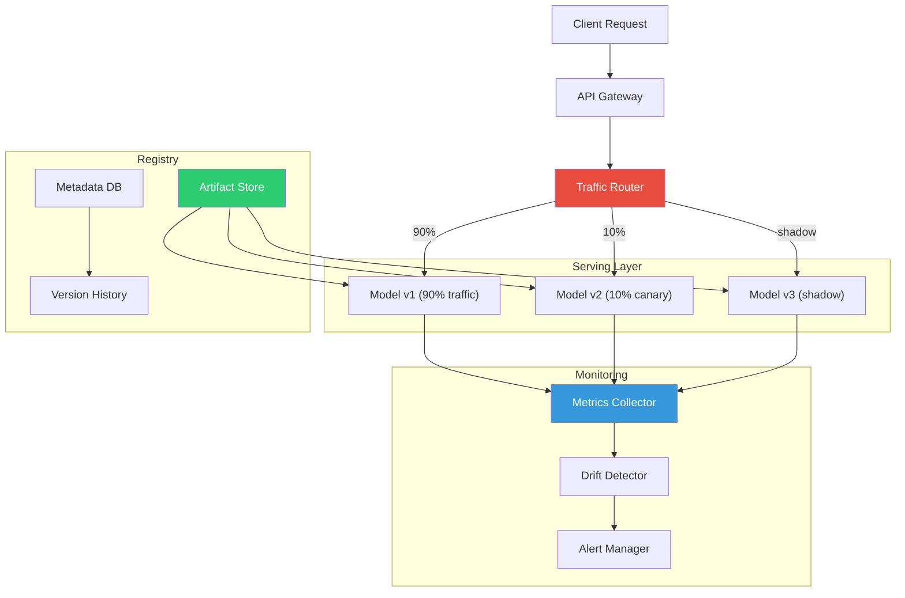
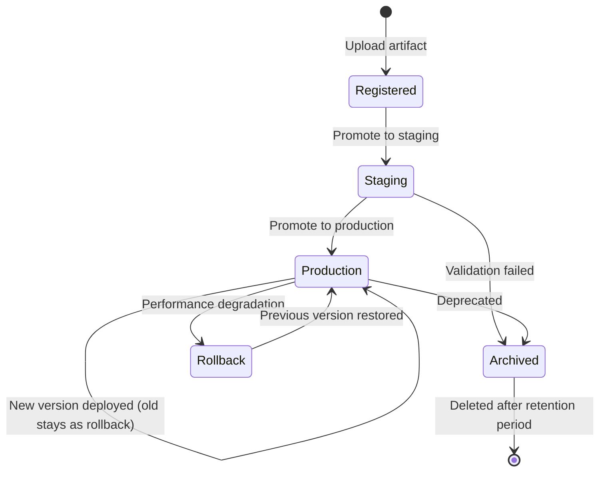
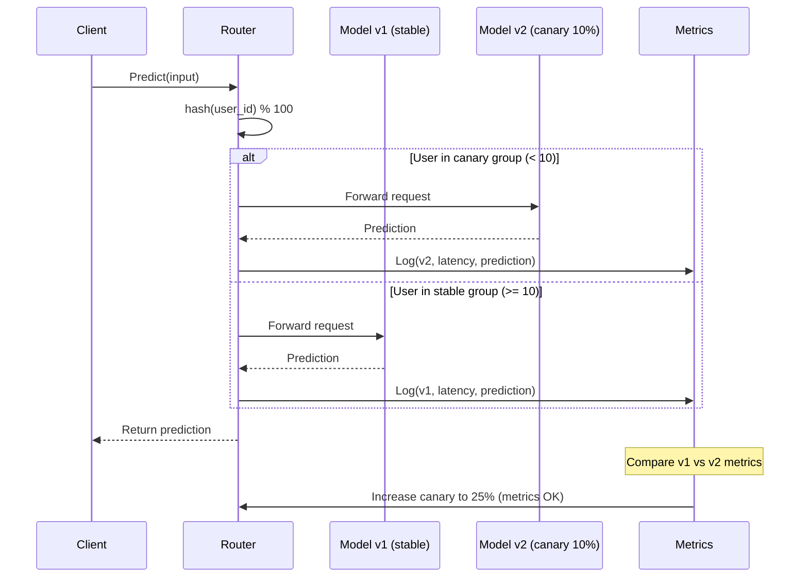

# ML Model Serving Platform

A production-grade machine learning model serving system built from first principles: a versioned model registry with artifact storage and metadata tracking, real-time inference serving with batching and caching, traffic routing for A/B tests and canary deployments, comprehensive monitoring with latency/accuracy/drift tracking, and auto-scaling based on request load and GPU utilization. Demonstrates the core architecture behind TFServing, Triton Inference Server, and SageMaker Endpoints — and why the gap between training a model and running it reliably in production is where most ML projects fail.

## Theory & Background

### The Model Serving Problem

Training a model is only half the battle. The other half — often the harder half — is serving that model reliably in production. A model that achieves 95% accuracy in a notebook is useless if it takes 2 seconds per request, crashes under load, or silently degrades as the input distribution shifts.

Model serving bridges the gap between a trained artifact (a file of weights) and a production service (an API that returns predictions). This involves solving several interconnected problems: **How do you version and deploy models without downtime?** (registry and deployment). **How do you test a new model without risking all traffic?** (A/B testing and canary). **How do you know when a model is failing?** (monitoring and drift detection). **How do you handle traffic spikes?** (auto-scaling and batching).

The core insight is that model serving is a **systems problem**, not a machine learning problem. The ML is frozen in the weights file — the challenge is building the infrastructure around it to make it fast, reliable, and observable.

### Architecture Overview

The platform consists of four layers: the **registry** stores and versions model artifacts, the **serving layer** loads models and handles inference requests, the **routing layer** directs traffic between model versions, and the **monitoring layer** tracks performance and triggers alerts.



### Model Registry

The registry is a versioned artifact store — think of it as "Git for models." Each model has a name, a lineage of versions, and metadata about how each version was trained (hyperparameters, training data hash, evaluation metrics).

A model version is identified by a tuple:

```math
\text{model\_version} = (\text{name}, \text{version}, \text{artifact\_hash}, \text{metadata})
```

The registry enforces **immutability**: once a version is registered, its artifact cannot be changed. This guarantees that version $v$ always refers to the same weights, making deployments reproducible.

**Model lifecycle stages** track where each version is in the deployment pipeline:



Each transition is logged with a timestamp, the user who initiated it, and the reason — creating a full audit trail for model governance.

### Inference Serving

The serving layer loads model artifacts into memory (or GPU) and handles prediction requests. The key challenge is **latency**: ML models are computationally expensive, and production SLAs typically require $p_{99}$ latency under 100ms.

**Request batching** amortizes the overhead of model inference across multiple requests. Instead of processing one request at a time, the server collects requests into a batch and runs them through the model together. This is especially effective on GPUs, where the cost of a forward pass is nearly constant whether the batch size is 1 or 32.

The batching strategy balances latency and throughput:

```math
\text{batch\_latency} = t_{\text{wait}} + t_{\text{inference}}(B)
```

where $t_{\text{wait}}$ is the time spent waiting for the batch to fill (bounded by a maximum wait time $T_{\text{max}}$) and $t_{\text{inference}}(B)$ is the inference time for batch size $B$. The server triggers a batch when either the batch is full ($B = B_{\text{max}}$) or the wait time expires ($t_{\text{wait}} = T_{\text{max}}$):

```math
\text{trigger} = (|\text{queue}| \geq B_{\text{max}}) \lor (t_{\text{wait}} \geq T_{\text{max}})
```

**Response caching** avoids redundant computation. If the same input has been seen recently, the cached prediction is returned directly. The cache uses an LRU eviction policy with a configurable TTL:

```math
\text{cache\_hit}(x) = \begin{cases} \text{cached}(x) & \text{if } x \in \text{cache} \land t_{\text{now}} - t_{\text{cached}} < \text{TTL} \\ \text{miss} & \text{otherwise} \end{cases}
```

### Traffic Routing: A/B Testing and Canary Deployments

Deploying a new model version to 100% of traffic is risky — if the new model is worse, all users are affected. Traffic routing strategies mitigate this risk:

**A/B testing** splits traffic between two model versions to measure which performs better. Users are deterministically assigned to a group (using a hash of their user ID) so they always see the same version:

```math
\text{group}(u) = \begin{cases} A & \text{if } \text{hash}(u) \mod 100 < p_A \\ B & \text{otherwise} \end{cases}
```

where $p_A$ is the percentage of traffic routed to version A.

**Canary deployment** gradually shifts traffic from the old version to the new one. The canary starts at a small percentage (e.g., 5%) and increases if metrics look good:

```math
p_{\text{canary}}(t) = \min\left(p_{\text{initial}} + \frac{t}{T_{\text{ramp}}} \cdot (1 - p_{\text{initial}}), 1.0\right)
```

If the canary's error rate exceeds a threshold, the deployment is automatically rolled back:

```math
\text{rollback if } \frac{\text{errors}_{\text{canary}}}{\text{requests}_{\text{canary}}} > \tau_{\text{error}}
```

**Shadow deployment** sends a copy of production traffic to the new model without returning its predictions to users. This lets you evaluate the new model on real data without any risk.



### Monitoring and Drift Detection

A model can fail silently — it keeps returning predictions, but the predictions are wrong. This happens when the input distribution shifts away from the training data (**data drift**) or when the relationship between inputs and outputs changes (**concept drift**).

**Data drift** is detected by comparing the distribution of incoming features against the training distribution. The Kolmogorov-Smirnov (KS) test measures the maximum distance between two cumulative distribution functions:

```math
D_{\text{KS}} = \sup_x |F_{\text{train}}(x) - F_{\text{prod}}(x)|
```

If $D_{\text{KS}}$ exceeds a threshold (typically 0.05-0.1), the feature has drifted significantly.

**Performance monitoring** tracks key metrics in real time:
- **Latency**: $p_{50}$, $p_{95}$, $p_{99}$ response times
- **Throughput**: Requests per second
- **Error rate**: Fraction of requests that fail (timeout, exception, invalid output)
- **Prediction distribution**: Histogram of model outputs (detects mode collapse or bias shift)

```mermaid
gantt
    title Model Deployment and Monitoring Timeline
    dateFormat X
    axisFormat %s

    section Deployment
        Register model v2          :0, 2
        Deploy to staging          :2, 5
        Staging validation         :5, 10
        Canary 5%                  :10, 20
        Canary 25%                 :20, 30
        Canary 50%                 :30, 40
        Full rollout 100%          :40, 50

    section Monitoring
        Baseline metrics (v1)      :0, 10
        Compare v1 vs v2           :10, 40
        Monitor v2 in production   :40, 60

    section Alerts
        Latency check              :10, 50
        Drift detection            :15, 60
        Error rate monitoring      :10, 60
```



### Tradeoffs and Alternatives

| Aspect | This Implementation | Alternative | Tradeoff |
|--------|-------------------|-------------|----------|
| **Serving runtime** | Python-based with batching | TFServing (C++), Triton (C++/CUDA), ONNX Runtime | Python is flexible and easy to extend; C++ runtimes are 2-10x faster but harder to customize; ONNX provides cross-framework portability but not all ops are supported |
| **Batching** | Dynamic batching with timeout | No batching (one-at-a-time), static batch size, continuous batching | Dynamic batching balances latency and throughput; no batching minimizes latency for single requests; continuous batching (used in LLM serving) maximizes GPU utilization for variable-length sequences |
| **Traffic routing** | Hash-based deterministic routing | Random routing, sticky sessions, feature-flag based | Hash-based ensures consistent user experience; random is simpler but users may see different versions across requests; feature-flag based gives fine-grained control but requires a flag management system |
| **Drift detection** | KS test on feature distributions | PSI (Population Stability Index), MMD (Maximum Mean Discrepancy), model-based drift detection | KS test is simple and interpretable; PSI is standard in finance; MMD works for high-dimensional data; model-based detection can catch concept drift but requires labeled production data |
| **Scaling** | Request-rate based auto-scaling | GPU utilization based, queue depth based, predictive scaling | Request-rate is simple and responsive; GPU utilization is more accurate for compute-bound models; queue depth catches backpressure; predictive scaling anticipates traffic but needs historical data |

### Key References

- Crankshaw et al., "Clipper: A Low-Latency Online Prediction Serving System" (2017) — [NSDI](https://www.usenix.org/conference/nsdi17/technical-sessions/presentation/crankshaw)
- Olston et al., "TensorFlow-Serving: Flexible, High-Performance ML Serving" (2017) — [arXiv](https://arxiv.org/abs/1712.06139)
- Sculley et al., "Hidden Technical Debt in Machine Learning Systems" (2015) — [NeurIPS](https://papers.nips.cc/paper/2015/hash/86df7dcfd896fcaf2674f757a2463eba-Abstract.html)
- Paleyes et al., "Challenges in Deploying Machine Learning: a Survey of Case Studies" (2022) — [ACM Computing Surveys](https://doi.org/10.1145/3533378)
- NVIDIA Triton Inference Server Documentation — [developer.nvidia.com](https://developer.nvidia.com/triton-inference-server)

## Real-World Applications

Model serving is the bridge between a trained ML model and a product feature that users interact with. Every time you get a product recommendation, have a transaction flagged for fraud, or use a translation service, a model serving system is handling the inference request behind the scenes — routing it to the right model version, returning a prediction in milliseconds, and monitoring for degradation.

| Industry | Use Case | Impact |
|----------|----------|--------|
| **Recommendation systems** | E-commerce and streaming platforms serving personalized recommendations in real time, A/B testing new ranking models against production baselines | Drives 30-40% of revenue for major e-commerce platforms; canary deployments prevent bad model versions from degrading recommendations for millions of users |
| **Fraud detection** | Financial institutions scoring transactions in real time (<50ms SLA), with shadow deployments to validate new fraud models on live traffic before switching | Catches fraudulent transactions worth billions annually; model versioning enables instant rollback if a new model increases false positives |
| **NLP APIs** | Language model inference for translation, summarization, and classification services, with dynamic batching to maximize GPU throughput | Reduces per-request inference cost by 3-5x through batching; auto-scaling handles 10x traffic spikes during peak hours without manual intervention |
| **Computer vision** | Real-time image classification and object detection for autonomous vehicles, manufacturing quality inspection, and medical imaging | Latency-critical serving (sub-10ms for autonomous driving); drift detection catches distribution shifts when cameras are replaced or lighting conditions change |
| **Personalization** | Ad-tech and content platforms serving user-specific models, routing traffic between demographic-specific model variants | A/B testing frameworks measure revenue impact of model changes with statistical rigor; canary deployments limit blast radius of model regressions to single-digit percentages of traffic |

## Project Structure

```
ml-model-serving/
├── src/
│   ├── __init__.py
│   ├── registry/
│   │   ├── __init__.py
│   │   ├── model_store.py         # Versioned artifact storage with immutability guarantees
│   │   ├── metadata.py            # Model metadata: hyperparameters, metrics, lineage
│   │   └── lifecycle.py           # Stage transitions: registered → staging → production → archived
│   ├── serving/
│   │   ├── __init__.py
│   │   ├── inference.py           # Model loading and prediction: single and batch inference
│   │   ├── batching.py            # Dynamic request batching with configurable max size and timeout
│   │   └── cache.py               # LRU prediction cache with TTL-based expiration
│   ├── routing/
│   │   ├── __init__.py
│   │   ├── router.py              # Traffic routing: weighted split, hash-based assignment
│   │   ├── ab_test.py             # A/B test configuration, user bucketing, metric collection
│   │   └── canary.py              # Canary deployment: gradual rollout, auto-rollback on error
│   └── monitoring/
│       ├── __init__.py
│       ├── metrics.py             # Real-time metrics: latency percentiles, throughput, error rate
│       ├── drift.py               # Data drift detection: KS test, feature distribution comparison
│       └── alerts.py              # Alert rules: threshold-based triggers, notification dispatch
├── requirements.txt
├── .gitignore
└── README.md
```

## Quick Start

```bash
pip install -r requirements.txt

# Register a model version in the registry
python -m src.registry.model_store --register --name sentiment --version 1 --artifact model.pkl

# Serve a model with dynamic batching
python -m src.serving.inference --model sentiment --version 1 --batch-size 16 --max-wait-ms 50

# Run an A/B test between two model versions
python -m src.routing.ab_test --model sentiment --version-a 1 --version-b 2 --split 80/20

# Start a canary deployment with auto-rollback
python -m src.routing.canary --model sentiment --stable 1 --canary 2 --initial-pct 5 --error-threshold 0.05

# Monitor model performance and detect drift
python -m src.monitoring.drift --model sentiment --version 1 --reference-data train_features.csv
```

## Implementation Details

### What makes this non-trivial

- **Dynamic batching with deadline-aware scheduling**: The batcher collects incoming requests into a batch, triggering inference when the batch is full or a timeout expires. The implementation tracks per-request deadlines so that no individual request waits longer than its SLA, even if the batch isn't full — this requires a priority queue ordered by arrival time and a background timer thread.
- **Deterministic traffic routing with consistent hashing**: The router assigns users to model versions using a hash of their user ID, ensuring the same user always sees the same version within an experiment. The implementation uses consistent hashing so that adding or removing a model version only reassigns a minimal number of users, preserving experiment integrity.
- **Canary deployment with automatic rollback**: The canary controller monitors error rate and latency of the new version in real time. If either metric exceeds a configurable threshold for a sustained period (not just a single spike), it automatically rolls back to the stable version and logs the reason. The implementation uses a sliding window of metrics to distinguish transient errors from systematic degradation.
- **KS-test drift detection on streaming data**: The drift detector maintains a reference distribution (from training data) and compares it against a sliding window of production features. Computing the KS statistic on every request would be expensive, so the implementation uses reservoir sampling to maintain a fixed-size sample of recent production data and runs the test periodically.
- **Model lifecycle with audit trail**: Every state transition (registered → staging → production → archived) is logged with a timestamp, initiator, and reason. The implementation enforces transition rules (e.g., you can't promote directly from registered to production without passing through staging) and supports rollback to any previous production version.
